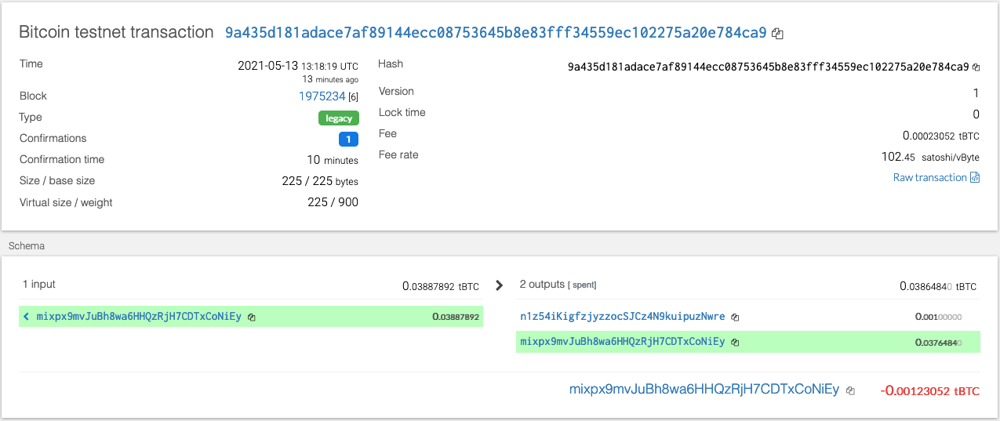

The address used in wallet.py code is the wallet address, the address in the nodes' folder used for accessing and running the chain (same as from hw 18 Zbank), which is connected to the wallet.
Mining nodes aren't actually responsible for maintaining the blockchain, they are only responsible for creating blocks to add to it. After these blocks are created, they are sent over the network to full nodes which validate them and add them to the blockchain.
Network nodes are responsible for the correctness and reliability of storing the entered data in the distributed ledger. Each node can store a complete copy of the distributed ledger. Thanks to the blockchain nodes, any user can access the data and can view all transactions conducted or stored on the network
hd-wallet-derive is a command-line tool that derives bip32 addresses and private keys for Bitcoin and many altcoins
Ethereum
MyCrypto is an Ethereum focused web wallet that allows Ledger users to store their Ethers as well as all ERC20 tokens. An open-source web-based wallet application, MyCrypto lets you manage the plethora of Ethereum-based tokens all while keeping your private keys offline.
BIP39 is the use of a mnemonic phrase -- a group of easy to remember words -- to serve as a back up to recover your wallet and coins in the event your wallet becomes compromised, lost, or destroyed. This is also known as a mnemonic seed (phrase), recovery phrase, wallet back up, master seed, etc
Json is the file that defines blockchain, like the “settings” for your blockchain. For example, the chain configuration, level of difficulty to mine blocks, etc.

Received BTCTEST funds (troubleshooting transaction issue)

,
## These screenshots are sending transactions to BTCTEST
def send_tx(coin,account,to,amount):
    if coin == ETH:
        raw_tx = create_tx(coin, account.address, to, amount)
        signed = account.signTransaction(raw_tx)
        return w3.eth.sendRawTransaction(signed.rawTransaction)
    if coin == BTCTEST:
        raw_tx = create_tx(coin, account, to, amount)
        signed = account.sign_transaction(raw_tx)
        return NetworkAPI.broadcast_tx_testnet(signed)

account = priv_key_to_account(BTCTEST, coins[BTCTEST][1]['privkey'])

#create_tx(BTCTEST, account, 'mixpx9mvJuBh8wa6HHQzRjH7CDTxCoNiEy', 0.001)

send_tx(BTCTEST, account, 'n1z54iKigfzjyzzocSJCz4N9kuipuzNwre', 0.001)

,(ScreenShot6.png),(ScreenShot7.png)
## This screen shots are sending test ETH transactions on MyCrypto wallet inlcuding troubleshooting 

def send_tx(coin,account,to,amount):
    if coin == ETH:
        raw_tx = create_tx(coin, account.address, to, amount)
        signed = account.signTransaction(raw_tx)
        return w3.eth.sendRawTransaction(signed.rawTransaction)
    if coin == BTCTEST:
        raw_tx = create_tx(coin, account, to, amount)
        signed = account.sign_transaction(raw_tx)
        return NetworkAPI.broadcast_tx_testnet(signed)

account = priv_key_to_account(ETH, coins[ETH][1]['privkey'])

send_tx(ETH, account, '0xd78168F576ee7F9C1D368195a596669907b1d66A', 124)

